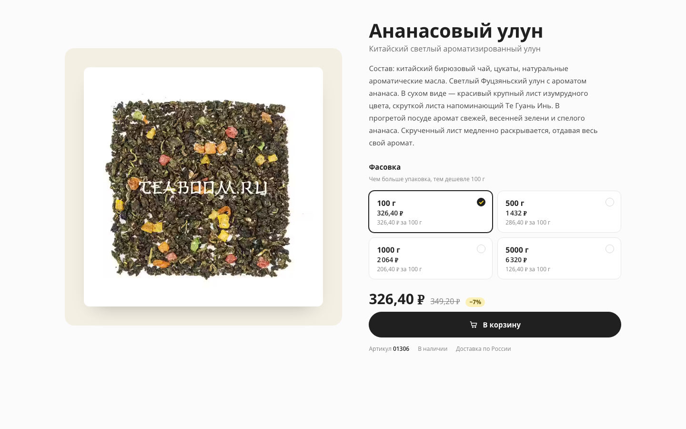

# Карточка товара Teaboom

Тестовое задание на позицию HTML-верстальщика: верхняя часть карточки товара «Ананасовый улун» для teaboom.ru.

## Демо

https://rtmkvtn.github.io/teaboom-product-card/

## Что сделано

- Изображение товара: фото с сайта в AVIF, WebP и JPEG через `picture`, `srcset` 800/970 px, `fetchpriority="high"`, явные `width`/`height`, осмысленный `alt`.
- Название (`h1`), категория подзаголовком под названием и блок с коротким описанием товара.
- Выбор фасовки: `fieldset` с четырьмя карточками-радиокнопками (вес, цена, цена за 100 г), кликабельна вся карточка.
- Актуальная цена, старая цена (`<s>`, зачёркнута, со скрытой подписью «Старая цена») и процент скидки; артикул в строке под кнопкой.
- Кнопка «В корзину»: обычное состояние (чёрная), при наведении (жёлтая), после клика на секунду «Добавлено»; для скринридеров действие озвучивается через `role="status"`.
- При переключении фасовки обновляются цена, старая цена, процент скидки, артикул и выбранное состояние.
- Адаптив под 1440, 768 и 375 px: на планшете две колонки сохраняются, на мобильном блок складывается в одну колонку: название и категория над фото, описание уходит под кнопку.

## Стек

HTML5, SCSS (Vite + sass-embedded), JavaScript без фреймворков, CSS Grid и Flexbox, Prettier. Без Bootstrap и готовых шаблонов.

## Запуск

```sh
npm i            # зависимости
npm run dev      # dev-сервер
npm run build    # сборка в dist/
npm run preview  # просмотр собранной версии
npm run format   # Prettier
```

## Деплой

GitHub Pages, источник — GitHub Actions. Workflow `.github/workflows/deploy.yml` запускается на push в `master` (и вручную): `npm ci`, `npm run build`, публикация `dist/`. Vite собирает с `base: /teaboom-product-card/`. Одна ручная правка: при включении Pages через API окружение `github-pages` разрешало деплой только с ветки `main`, политику веток в настройках репозитория один раз переключили на `master`.

## Структура проекта

```
index.html                    # разметка карточки со статическими значениями для 100 г
public/images/                # фото товара 800 и 970 px
src/main.js                   # инициализация: рендер фасовок, переключение, кнопка
src/variants.js               # данные фасовок и производные (скидка, подпись веса)
src/format.js                 # формат цены и цена за 100 г
src/styles/main.scss          # точка входа, подключает партиалы
src/styles/_variables.scss    # цвета, брейкпоинты, типографика, размеры
src/styles/_base.scss         # сброс, body, контейнер, visually-hidden
src/styles/_card.scss         # сетка карточки, фото, цена, мета
src/styles/_selector.scss     # карточки фасовок и их состояния
src/styles/_button.scss       # кнопка «В корзину» и её состояния
.github/workflows/deploy.yml  # сборка и публикация на GitHub Pages
```

## Решения и что намеренно не сделано

- Корзины и бэкенда нет: кнопка только показывает короткое состояние «Добавлено».
- Сайт не переделывался, свёрстана только карточка. Скругления и тени — намеренное смягчение квадратного стиля сайта; палитра сохранена, Open Sans подключён с Google Fonts, шрифт не хостится в проекте.
- Автотестов нет, вместо них ручной чек-лист ниже.
- Фото — файл с сайта, лежит в репозитории; водяной знак оставлен, как разрешает задание.
- Описание — текст с сайта без последнего предложения (ссылки на другой товар).

## Затрачено

Затрачено: ≈ 0,5 ч (планирование и подбор референсов по дизайну сделаны отдельно, заранее)

## Скриншот



## Проверено вручную

- [x] 1440 px: две колонки, панель с фото, карточки фасовок 2×2, пара цен, чёрная кнопка; горизонтального скролла нет.
- [x] 768 px: две колонки сохранены, ничего не наезжает, карточки 2×2; горизонтального скролла нет.
- [x] 375 px: одна колонка; порядок: название, категория, фото, фасовка, цена, кнопка, артикул, описание; горизонтального скролла нет.
- [x] Выбор каждой из четырёх фасовок обновляет цену, старую цену, процент скидки и артикул по таблице из задания.
- [x] Без JavaScript страница показывает значения для 100 г, карточка 100 г отмечена.
- [x] Tab доходит до фасовок, стрелки переключают выбор, фокус виден; Space или Enter на кнопке включает «Добавлено», которое сбрасывается примерно через секунду.
- [x] При наведении кнопка становится жёлтой.
- [x] Сборка через `npm run preview` загружает оба изображения и шрифт; опубликованная страница совпадает.
